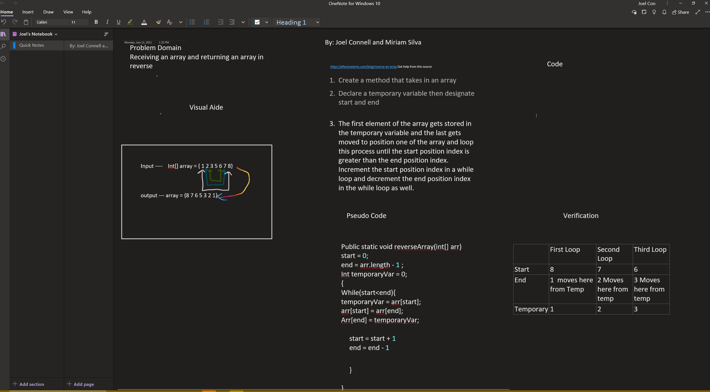
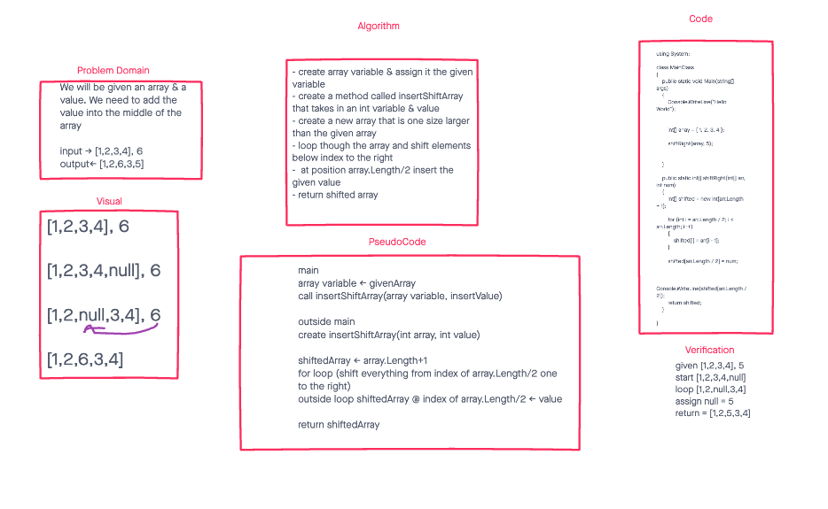
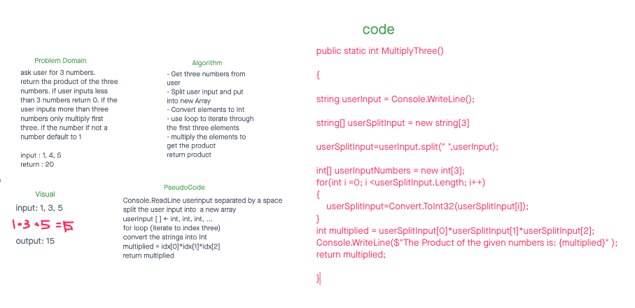

# Data Structures and Algorithms

## Language: `C#`

### Code challenges for our 401 class.
### Code challenge partner: Joel Connell

# WhiteBoards
## Code Challenge 01  - Reverse Array

## Code Challenge 02 - Insert Shift Array

## Code Challenge 03 - Insert Shift Array

# Help From
