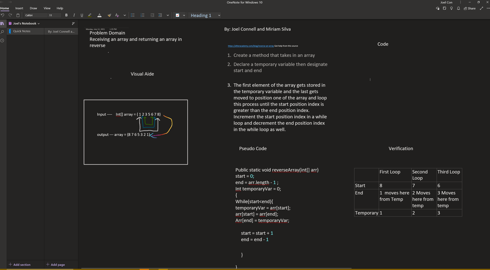

# Code Challenge 01

## Whiteboard

## With Help From:
- Joel Connell

# Code Challenge 02

## Whiteboard

## With Help From:
- Joel Connell

# Code Challenge 03

## Whiteboard

## With Help From:
- Joel Connell

# Code Challenge 06

## Whiteboard

## With Help From:
- Joel Connell

# Code Challenge 07

## Whiteboard

## With Help From:
- Joel Connell

# Code Challenge 08

## Whiteboard

## With Help From:
- Joel Connell

# Code Challenge 10

## Stack & Queues
- Created a Node Class
  - Properties (Value & Next)
- Created a Stack Class
  - Methods:
    - Push() : Adds Node to the top of the stack
    - Pop() : Returns the value of the top node
    - Peek() : Gives you the value of the top node
    - IsEmpty() : Boolean indicating if stack is empty
- Created a Queue Class
  - Methods:
    - Enqueue() : Adds node to the back of the queue
    - Dequeue() : Returns value of node at the front of queue
    - Peek() : Gives you the value located at the front of the queue
    - IsEmpty() : Boolean that returns true or false if queue is empty

## With Help From:
- Joel Connell

# Code Challenge 11

## Whiteboard

## With Help From:
- Joel Connell

# Code Challenge 13

## Whiteboard

## With Help From:
- Joel Connell

# Code Challenge 15
## Binary Trees
- Created Node Class
  - With properties for the values in the node, the left child node & the right child node
- Created Binary Tree Class
  - With Traversal Methods:
    - PreOder()
    - InOrder()
    - PostOrder()
- Created Binary Search Tree Class
  - With Methods:
    - Add() : Adds a new node in the corrent location
    - Contains() : Returns true or false depending on whether value is in tree or not

## With Help From:
Joel Connell

# Code Challenge 16

## Whiteboard

## With Help From:
- Qaalid Hashi (Q)

# Code Challenge 17

## Whiteboard

## With Help From:
- Qaalid Hashi (Q)

# Code Challenge 18

## Whiteboard

## With Help From:
- Jona Brown

# Code Challenge 26
Given an array use sort to traverse the array as it slowly sorts the array out the array sequence

## Whiteboard

## With Help From:
- Joel
- Q

